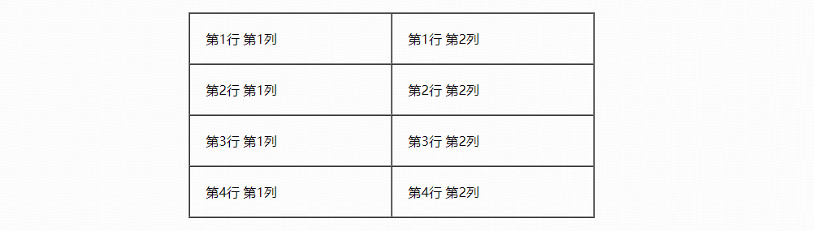

# 1 HTML概述

## 1.1 关于HTML标签

* HTML标签是由尖括号包围的关键词，例如`<html>`。
* HTML标签通常是成对出现的，例如`<html>`和`</html>`，称为**双标签**；其中第一个标签是开始标签，第二个标签是结束标签。
* 有些特殊的标签必须是单个标签，例如`<br />`，称为**单标签**。

## 1.2 基本结构标签

```html
<html>  <!-- 页面中最大的标签，称为根标签 -->
    <head>  <!-- 文档的头部，在head内，必须设置title -->
        <title>我的第一个页面</title>  <!-- 页面的标题 -->
    </head>
    <body>  <!-- 文档的主体，包含文档的所有内容 -->
        这是页面的内容。
    </body>
</html>
```

## 1.3 DOCTYPE、lang以及字符集的作用

```html
<!DOCTYPE html>  <!-- 指定当前文档的类型为html5 -->
<html lang="en">  <!-- lang属性，指定当前文档的显示语言 -->
<head>
        <meta charset="UTF-8"/>  <!-- 指定字符集为UTF-8 -->    
</head>
<body>

</body>
</html>
```

说明：

1. `<!DOCTYPE html>`声明必须写在整个页面的第一行，位于`<html>`标签之前；
2. `<!DOCTYPE html>`并不是一个HTML标签，而是文档类型声明标签；
3. `lang="en"`表示将当前网页语言设置为英语，`lang="zh-CN"`则是设置语言为简体中文。

> 实际上，语言设置为en的网页文档也可以显示中文，设置为zh-CN的文档也可以显示英文。（这个属性只是对浏览器起到一个提示的作用，比如当文档内容的语言和这个属性设置的语言不一致时，浏览器自动提示是否进行翻译）

## 1.4 注释和特殊字符

```html
<!-- 这是一个注释 -->
<!-- <!-- 这是错误的，多行注释不允许嵌套 --> -->
```


> 重点记住**空格、大于号、小于号**这三个，其余都使用得很少，在需要使用时回头查阅即可。

# 2 常用标签

## 2.1 标签语义

学习标签的重点是记住每个标签的语义，即这个标签是用来干嘛的。

> 根据标签的语义，在合适的地方给一个最为合理的标签，可以让页面结构更加清晰。


## 2.2 标题标签

HTML提供了6个等级的网页标题，即`<h1>`-`<h6>`。

```html
<h1> 我是一级标题 </h1>
<h2> 我是二级标题 </h2>
<h3> 我是三级标题 </h3>
<h4> 我是四级标题 </h4>
<h5> 我是五级标题 </h5>
<h6> 我是六级标题 </h6>
```

> 标签语义：将文字作为标题使用，且表示得重要性和字号随着级别递减。

特点：

1. 加了标题标签的文字都会被加粗，字号也会依次变大；
2. 一个标题独占一行。

## 2.3 段落标签

在网页中，要把文字有条理地显示出来，就需要将这些文字分段显示。

在 HTML 标签中，`<p>`标签用于定义段落，它可以将整个网页分为若干个段落。

```html
<p> 我是一个段落 </p>
<p> 我是另一个段落 </p>
```

> 标签语义：可以把 HTML 文档分割为若干段落。

特点：

1. 文本在一个段落中**会根据浏览器窗口的大小自动换行**；
2. 段落和段落之间保有空隙。

## 2.4 换行标签

在 HTML 中，一个段落中的文字会从左到右依次排列，直到浏览器窗口的右端，然后才自动换行。

如果希望某段文本强制换行显示，就需要使用换行标签`<br />`。

```html
<p>大家好<br/>我是...</p>
```

> 标签语义：强制换行。

特点：

1. `<br />`是个单标签；
2. `<br />`标签只是简单地开始新的一行，跟段落不一样，段落之间会自动插入一些垂直的间距。

## 2.5 文本格式化标签

在网页中，有时需要为文字设置**粗体**、*斜体*或<u>下划线</u>等效果，这时就需要用到HTML中的文本格式化标签，使文字以特殊的方式显示。


> 标签语义: 突出重要性, 比普通文字更重要。

## 2.6 盒子标签

`<div>`和`<span>`这两个标签是没有语义的，它们就是一个盒子，用来装入内容，进行页面布局。

```html
<div> 这是头部 </div>
<span> 今日价格 </span>
```

特点：

1. `<div>`标签是一个大盒子，属于块元素，一行只能放一个`<div>`；
2. `<span>`标签是一个小盒子，属于行内元素，一行可以放多个`<span>`。

## 2.7 图像标签

``标签用于在HTML页面中显示图像。

```html

```

| 属性    |  说明                        |是否必须设置|
|:-------:|:---------------------------:|:---------:|
| `src`   | 用于指定图像文件的路径和文件名 | 是        | 
| `width` | 设置图像的宽度               | 否        |
| `height`| 设置图像的高度               | 否        |

## 2.8 超链接标签

```html
<a href="跳转目标" target="目标窗口的弹出方式">文本或图像</a>
```

| 属性    |  说明                        |是否必须设置|
|:-------:|:---------------------------:|:---------:|
| `href`  | 用于指定图像文件的路径和文件名 | 是        |
| `target`| 用于指定连接页面的打开方式。`_self`为默认值，`_blank`为在新窗口中打开 | 否 |

如果`href`属性设置的地址是一个文件或者压缩包，则点击之后会下载这个文件。

```html
<a href="img.zip"></a>
```

`<a>`标签还可以作为锚点链接标签。

```html
<a href = "#two">第二季</a>  <!-- 在链接文本的href属性中，设置属性值为 #名字 -->
<h3 id = "two">第二季介绍</h3>  <!-- 找到目标位置标签，里面添加一个 id属性=刚才的名字 -->
```

点击“第二季”链接，可以快速跳转到页面中的id属性为“two”的标签的位置。

## 2.9 视频音频标签


# 3 表格、列表和表单

## 3.1 表格

`table`用来定义表格的标签：

* `tr`用来定义表格中的行，必须嵌套在`<table></table>`标签中
* `td`用来定义表格中的单元格，必须嵌套在`<tr></tr>`标签中
* `th`用来定义表格中的表头的单元格，表头单元格里面的内容加粗居中显示

```html
<body>
    <table>
        <tr>  <th>姓名</th>  <th>性别</th>  <th>年龄</th>  </tr>
        <tr>  <td>林晓</td>  <td>男</td>    <td>18</td>    </tr>  
        <tr>  <td>林晓</td>  <td>男</td>    <td>18</td>    </tr>        
        <tr>  <td>林晓</td>  <td>男</td>    <td>18</td>    </tr>
    </table>
</body>
```

### 3.1.1 表格标签属性

|属性名     | 属性值                   | 描述                                            | 是否必须设置 |
|:---------:|:-----------------------:|:-----------------------------------------------:|:----------:|
| `align`   | `"left"`,`"center"`,`"right"` |	规定表格相对周围元素的对齐方式             | 否         |
| `border`  | `"1"`或者`""`              | 规定表格单元是否拥有边框，默认为" "，表示没有边框 | 否         |
| `cellpadding`  | 像素值              | 规定单元边沿与其内容之间的空白，默认1像素           | 否         |
| `cellspacing` | 像素值               | 规定单元格之间的空白，默认2像素                    | 否         |
| `width`   | 像素值或百分比            | 规定表格的宽度                                   | 否         |

编写一个在页面中居中、有边框、规定单元边沿与其内容之间的空白为20像素、规定单元格之间的空白为0像素、宽度为500像素的表格。

```html
<table align="center" border="1" cellspace="0" cellpadding="20" width="500">
    <tr><td>第1行 第1列</td><td>第1行 第2列</td></tr>
    <tr><td>第2行 第1列</td><td>第2行 第2列</td></tr>
    <tr><td>第3行 第1列</td><td>第3行 第2列</td></tr>
    <tr><td>第4行 第1列</td><td>第4行 第2列</td></tr>
</table>
```



### 3.1.2 表格结构标签

为了更好的表示表格的语义，可以将表格分割成**表格头部**和**表格主体**两大部分。

* 用`<thead></thead>`标签表示表格的头部区域，`<thead>`内部必须拥有`<tr>`标签，一般是位于第一行，`<tr>`中使用`<th>`存放数据
* 用`<tbody></tbody>`标签表示表格的主体区域，主要是用于放数据本体（一系列的`<tr>`标签，各自内部使用`<td>`存放数据）

> 以上标签都是放在`<table></table>`标签中。


### 3.1.3 合并单元格

* 跨行合并：rowspan=“合并单元格的个数”
* 跨列合并：colspan="合并单元格的个数"

```html
<td colspan = "2"></td>
```

## 3.2 列表

有序列表和无序列表。

|标签名       | 语义      | 说明                               |
|:-----------:|:---------:|:--------------------------------:|
| `<ul></ul>` | 无序列表   | 里面只能包含`<li></li>`，没有顺序  |
| `<ol></ol>` | 有序列表   | 里面只能包含`<li></li>`，有顺序    |

```html
<h2>无序列表</h2>
<ul>
    <li>哼哧哼哧</li>
    <li>咕噜咕噜</li>
    <li>吧唧吧唧</li>
</ul>

<h2>有序列表</h2>
<ol>
    <li>第一条</li>
    <li>第二条</li>
    <li>第三条</li>
</ol>
```


> `<li></li>`中可以包含放任何标签。

自定义列表：`<dl></dl>`。（里面只能包含`<dt></dt>`和`<dd></dd>`。）

```html
<dl>
     <dt>关注我们</dt>
     <dd>新浪微博</dd>
     <dd>联系我们</dd>
</dl>
```


> `<dt></dt>`和`<dd></dd>`中也可以包含任何标签。

## 3.3 表单

<!-- # 4 新增语义化标签
页面的布局一般使用`<div>`标签，但是`<div>`对于搜索引擎来说，是没有语义的。

新增语义化标签如下：


-->


