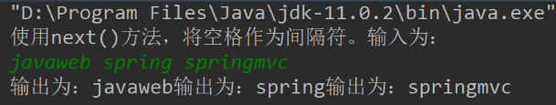
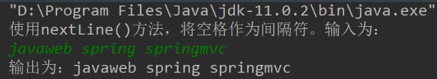

# 1 Java语言概述


# 2 Java基本语法

## 2.1 读取用户输入

### 2.1.1 `next()`和`nextLine()`的区别：

* `next()`：一定要读取到有效字符后才可以结束输入，对输入有效字符之前遇到的空格键、Tab键或Enter键等结束符，`next()`方法会自动将其去掉，只有在输入有效字符之后，`next()`方法才将其后输入的空格键、Tab键或Enter键等视为分隔符或结束符。所以 next() 不能得到带空格的字符串。

> 使用`nextInt()`方法时，与`next()`方法类似，只是它的返回值是`int`类型的，依旧将空格看作是两个输入的数据的间隔。

* `nextLine()`：是遇到回车符才结束读取，所以可以得到带空格的字符串。

```java
public class Test {
    public static void main(String args[]) {
        Scanner sc = new Scanner(System.in);
        System.out.println("使用next()方法，将空格作为间隔符。输入为：");
        while (sc.hasNext()) {
            System.out.print("输出为：");
            String n = sc.next();
            System.out.print(n);
        }
    }
}
```



```java
public class Test {
    public static void main(String args[]) {
        Scanner sc = new Scanner(System.in);
        System.out.println("使用nextLine()方法，将空格作为间隔符。输入为：");
        while (sc.hasNext()) {
            System.out.print("输出为：");
            String n = sc.nextLine();
            System.out.print(n);
        }
    }
}
```



```java
public class Test {
	public static void main(String[] args) {
        Scanner input = new Scanner(System.in);

        System.out.println("请输入字符串（next）：");
        String str = input.next();
        System.out.println(str);

        System.out.println("请输入字符串（nextLine）：");
        String str1 = input.nextLine();
        System.out.println(str1);
    }
}
```

### 2.1.2 


## 2.2 


# 3 Java面向对象

`this.属性名`表示当前类的属性，`super.属性名`表示当前类的父类的属性。
一般情况下会省略`this`和`super`。
> 在子类中，允许定义和它的父类同名的属性，数据类型可以相同也可以不同。
如果子父类中定义同名的属性，则子类的对象在内存之中共有两个同名属性，需要使用`this`和`super`来加以区分。
使用`this.属性名`其本质上是现在当前类中找这个属性，如果找不到，就会去到父类中寻找。
我们可以在子类中
的方式，显式的调用父类中声明的属性或方法。但是，通常情况下，我们习惯省略"super.

