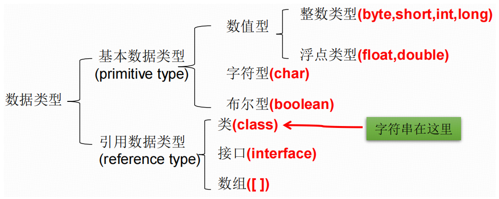
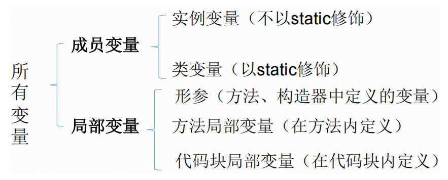
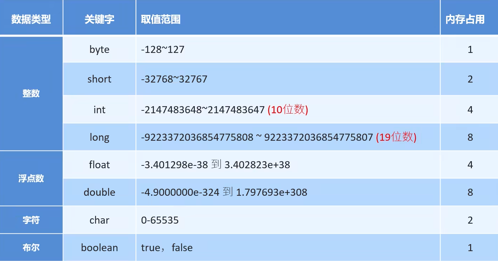
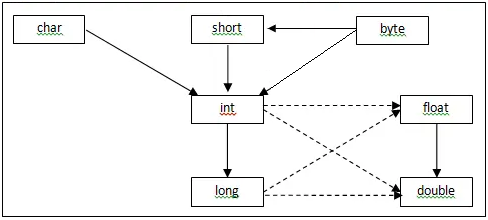

# 1 变量和数据类型

## 1.1 变量

### 1.1.1 Java中的变量

&emsp;&emsp;变量是内存中的一个存储区域，该区域内的数据可以在同一类型范围内不断变化。是程序中最基本的存储单元。包含**变量类型、变量名和存储的值**。

&emsp;&emsp;Java对于每一种数据都定义了明确的数据类型，在内存中分配了不同大小的内存空间。（Java属于**强类型**编程语言）



> 作用：用于在**内存中**保存数据。

### 1.1.2 变量的定义

```java
//变量的定义
int myAge = 23;
//变量的使用
System.out.println(myAge);

//变量的声明
int number;
//变量的赋值
number = 1001;
//变量的使用
System.out.println(number);
```

说明：

1. Java中每个变量都必须先声明并赋值，后使用（若未赋值且没有默认初始化值，则不能使用）；
2. 我们使用**变量名**来访问这块区域的数据；
3. 变量只有在其作用域（其定义所在的一对`{}`内的范围）内有效，出了这个作用域就无效了；
4. 同一个作用域内，不能定义同名的变量。（和类型无关，只要同名就不行）

### 1.1.3 变量的分类（按声明的位置的不同）



## 1.2 八种基本数据类型



## 1.3 基本数据类型变量间转换（7种，不包括`boolean`，`boolean`不能转换为其他基本数据类型）

### 1.3.1 自动类型提升

容量小的数据类型和容量大的数据类型做运算，结果自动提升为容量大的类型。

```java
int i = 200000000;
long l = 9000000000000L;
float f = 23.45F;
double d = 234.12F;

long l1 = i + l;
float f1 = f + i;
double d1 = d + i;
```

`byte`、`short`和`char`三种类型做运算，即使没有`int`参与，结果一定是`int`类型。

```java
byte b1 = 10;
byte b2 = 20;
int resA = b1 + b2;

short s1 = 3000;
short s2 = 3001;
int resB = s1 + s2;

char c1 = 'a';
char c2 = 'b';
int resC = c1 + c2;

int resD = b1 + s1 + c1;
int resE = b1 + s1; //byte永远不会在运算过程中自动提升为short
int resF = b1 + c1; //byte永远不会在运算过程中自动提升为char
int resG = s1 + c1; //既不转化为short，也不转化为char
```

> 解释：Java在做运算时，如果操作数均在`int`的范围内，那么一律在`int`的空间内运算，运算的结果自然也就是`int`类型。

仅仅就赋值而言，`byte`可以自动类型提升为`short`，但不能自动类型提升为`char`。

```java
byte b = 10;
short s = b;  //通过
char c = b;  //错误
```



说明：

1. 上图中实线表示自动类型提升时不会造成数据丢失，虚线则可能会出现数据丢失问题；
2. 这里说的容量大小指的是存储数值的范围，不是占据内存空间的大小。（`float`占据的内存空间比`long`要少，但是其表示数据的范围远远大于`long`）

### 1.3.2 强制类型转换（自动类型提升的逆运算）

强制类型转换，可能导致精度损失，但是**这也是不一定的**。

```java
double d = 23.55;
int i = (int)d;
System.out.println("i=" + i);//i=23，截断操作，不会四舍五入

long l = 120;
byte b = (byte)l;
System.out.println(b);//没有精度损失

int i1 = 128;
byte b1 = (byte)i1;
System.out.println("b1=" + b1);//-128，数据溢出
```
