# 1 变量和数据类型

## 1.1 变量

### 1.1.1 Java中的变量

&emsp;&emsp;变量是内存中的一个存储区域，该区域内的数据可以在同一类型范围内不断变化。是程序中最基本的存储单元。包含**变量类型、变量名和存储的值**。

&emsp;&emsp;Java对于每一种数据都定义了明确的数据类型，并分别在内存中分配了不同大小的内存空间。（Java属于**强类型**编程语言）


> 作用：用于在**内存中**保存当前程序运行所产生的数据。（我们使用*变量名*来访问这块区域的数据）

### 1.1.2 变量的声明和初始化

> 声明和初始化可以同时进行，也可以不同时进行。

```java
//在声明的同时初始化
int myAge = 23;

System.out.println(myAge);

//变量声明
int number;
//变量初始化
number = 1001;

System.out.println(number);

//只声明，不初始化
int distance;

System.out.println(distance);  //错误：可能尚未初始化变量distance

System.out.println(time);  //错误：找不到符号time，变量time未声明
```

说明：

1. Java中每个变量都必须先声明并初始化，后使用；
2. Java中的某些变量（类的属性、数组的元素）具有默认初始化值，声明后自带默认值，是可以直接使用的；
3. 变量只有在其作用域内有效，出了作用域就无效了；（定义域即该变量的声明语句所在的那一对`{}`内的范围）
4. 在同一个作用域内，不能定义同名的变量。（和类型无关，只要两个变量同名就不行）

### 1.1.3 变量的分类（按声明的位置的不同）


## 1.2 八种基本数据类型


## 1.3 基本数据类型变量间的转换（7种，不包括`boolean`，`boolean`不能转换为其他基本数据类型）

### 1.3.1 自动类型提升

容量小的数据类型和容量大的数据类型做运算，结果自动提升为容量大的类型。

```java
int i = 200000000;
long l = 9000000000000L;
float f = 23.45F;
double d = 234.12F;

long l1 = i + l;
float f1 = f + i;
double d1 = d + i;
```

`byte`、`short`和`char`三种类型做运算，即使没有`int`参与，结果也一定是`int`类型。

```java
byte b1 = 10;
byte b2 = 20;
int resA = b1 + b2;

short s1 = 3000;
short s2 = 3001;
int resB = s1 + s2;

char c1 = 'a';
char c2 = 'b';
int resC = c1 + c2;

int resD = b1 + s1 + c1;
int resE = b1 + s1; //byte永远不会在运算过程中自动提升为short
int resF = b1 + c1; //byte永远不会在运算过程中自动提升为char
int resG = s1 + c1; //既不转换为short，也不转换为char，而是转换为int
```

> 解释：Java在做运算时，如果操作数均在`int`的范围内，那么一律在`int`的空间范围内运算，运算的结果自然也就是`int`类型。

仅仅就赋值而言，`byte`可以自动类型提升为`short`，但并不能自动类型提升为`char`。

```java
byte b = 10;
short s = b;  //通过
char c = b;  //错误
```


说明：

1. 上图中实线表示自动类型提升时不会造成数据丢失，虚线则可能会出现数据丢失问题；
2. 这里说的容量大小指的是存储数值的范围，不是占据内存空间的大小。（`float`占据的内存空间比`long`要少，但是其表示数据的范围远远大于`long`，即`float`的容量大于`long`）

### 1.3.2 强制类型转换（自动类型提升的逆运算）

强制类型转换，可能导致精度损失，但是**也不一定的**。

```java
double d = 23.55;
int i = (int)d;
System.out.println("i=" + i);  //i=23，截断操作，不会四舍五入

long l = 120;
byte b = (byte)l;
System.out.println(b);  //没有精度损失

int i1 = 128;
byte b1 = (byte)i1;
System.out.println("b1=" + b1);  //-128，数据溢出
```

## 1.4 `String`类型变量的使用

`String`属于*引用数据类型*，翻译为：字符串。

```java
String str1 = "Hello World!";
String str2 = "";//空串
```

`String`可以和8种基本数据类型（包括`boolean`类型）的变量做运算，但只能是连接运算。

```java
int number = 1001;
String numberStr = "学号：";
String info = numberStr + number;//学号：1001

boolean bool = true;
String boolStr = "判断结果：";
String res = boolStr + bool;//判断结果：true
```

如果`+`前或后的操作数（至少有一个）是`String`，则是连接运算，否则是加法运算。

```java
char c = 'a';
int num = 10;
String str "hello";

System.out.println(c + num + str);//107hello
System.out.println(c + str + num);//ahello10
```

> 无论作为算术运算符还是连接运算符，`+`都是从左往右运算，计算的顺序很重要。

给`String`变量赋值必须使用`String`类型，这里**并不存在什么自动类型提升**。

```java
String s1 = "423";//正确

String s2 = 423;//错误
String s3 = 'a';//错误
```

`char`类型不是`String`类型（特别注意），也不能自动类型提升为`String`类型。

```java
char c = 'a';
String s = c;//错误，无法将char转化为String
```

说明：

1. 字符串类型字面量的内容存放在一对双引号`""`内，可以包含unicode支持的任何字符，可以存放0到任意多个字符，只要不超过内存空间的限制就不会有问题；
2. 因为`String`类型和8种基本数据类型的连接运算结果都是`String`，我们可以通过`变量或数值 + ""`的方式将基本数据类型数据直接转化为`String`类型，例如`String s = 4 + "";`；（这不是自动类型提升）
3. Java不允许通过强转的方式将`String`转化为基本数据类型，例如：`int i = (int)s;`会直接报错；（这个功能可以通过目标基本数据类型对应的包装类提供的某些方法来实现）

## 1.5 使用`Scanner`从键盘获取用户输入

```java
//1.导入对应工具类
import java.util.Scanner;

//2.将Scanner类实例化
Scanner scanner = new Scanner(System.in);

//3.调用Scanner实例的相关方法来读取输入
int num = scanner.nextInt();
```

我们通过查询API文档来知晓`Scanner`中提供了哪些方法，以及这些方法分别用于接收什么类型的键盘输入数据，然后调用我们需要的方法来接收数据。

```java
Scanner scanner = new Scanner(System.in);

//读取字符串
System.out.print("请输入你的姓名：");
String name = scanner.next();
System.out.println("name=" + name);

//读取整数
System.out.print("请输入你的年龄：");
int age = scanner.nextInt();
System.out.println("age=" + age);

//读取布尔类型
System.out.print("这是真的吗？(true/false)");
boolean isReal = scanner.nextBoolean();
System.out.println("isReal=" + isReal);
```

说明：

1. 我们必须根据相应的方法，来输入指定类型的数据值（当输入的数据的类型与方法要求的类型不匹配时，会报异常：`InputMatchException`，程序终止运行）；
2. `Scanner`并不支持读取一个字符，只能读取一个字符串，然后再调用`String`对象的`charAt()`方法获取指定位置的字符。

# 2 运算符

## 2.1 算术运算符

加、减、乘、除和取模。

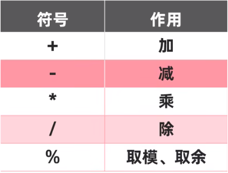

自增自减运算符。


```java
int i1 = 100;
System.out.println(++i1);//输出为101，先自增1，再发挥作用

int i2 = 100;
System.out.println(i2++);//输出为100，先发挥作用，再自增1

//如果自增运算单独写一行，那么无所谓先自增还是后自增，没有任何区别
int i3 = 100;
i3++;
int i4 = i3;//i4=101
```

## 2.2 赋值运算符

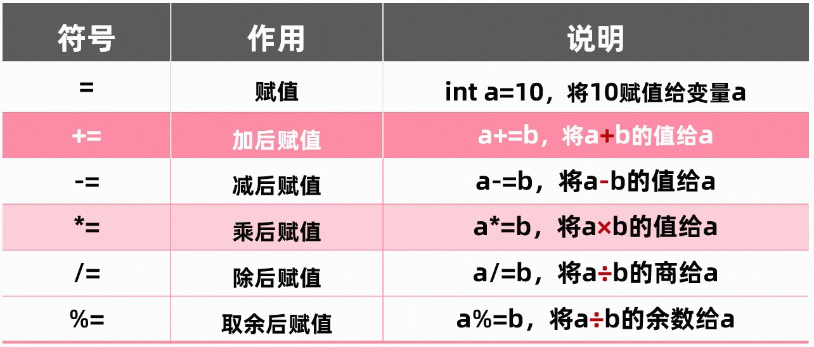

当`=`两侧的数据类型不一致时，按照自动类型提升或强制类型转换原则进行处理。

```java
int i = 100;
long l = i;

double d = 24.5;
float f = (float)d;
```

普通赋值号`=`支持连续赋值。

```java
int i = 10;
int j = 10;

//上面两句还可以这样写
int i1, j1;
i1 = j1 = 10;

//扩展，以下的写法也是OK的
int i2 = 10, j2 = 20;
```

> 也就是说，赋值运算`a=b`是有返回值的。（返回值就是用来赋给变量`a`的那个`b`的值）


## 2.3 比较运算符

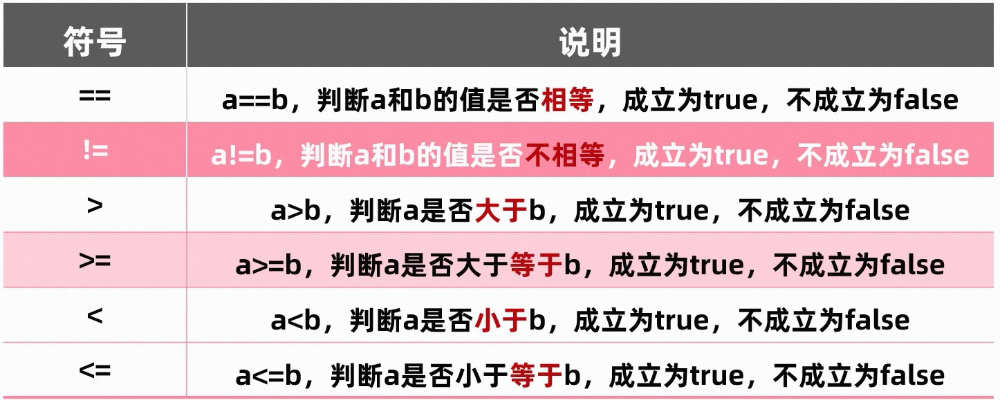

## 2.4 逻辑运算符

用于`boolean`类型数据之间的运算。

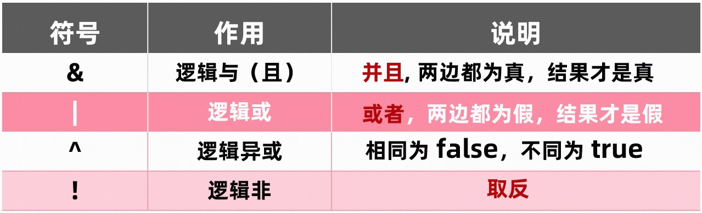

短路逻辑运算符。


## 2.5 位运算符

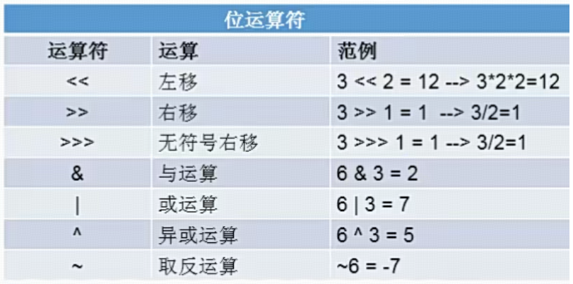

## 2.6 三元运算符

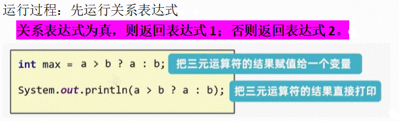

## 2.7 运算符的优先级

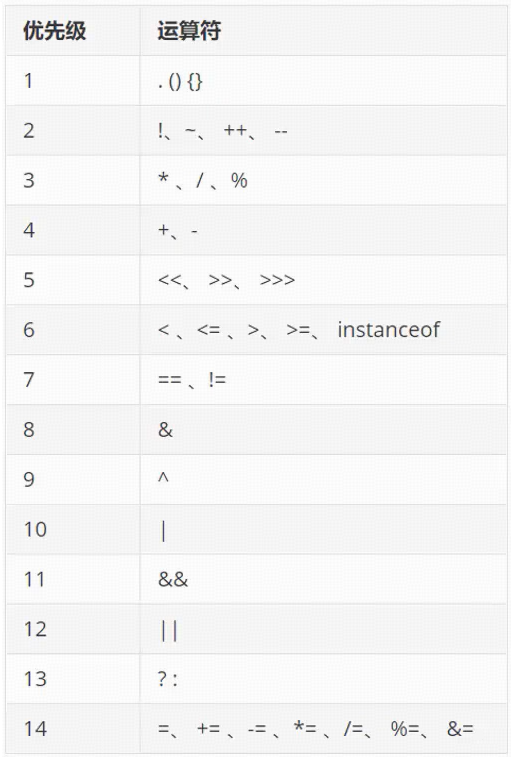

省流：不用管什么优先级，把需要优先执行的运算放小括号里就行了。

# 3 控制流

## 3.1 分支结构

### 3.1.1 if-else

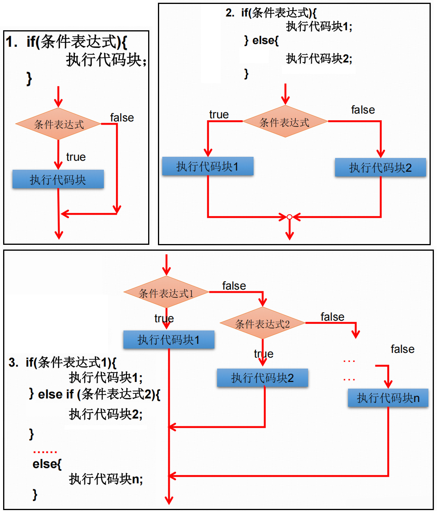

### 3.1.2 switch-case

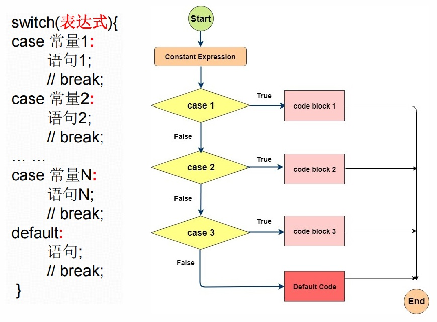

## 3.2 循环结构

### 3.2.1 for

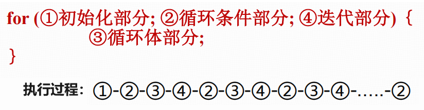

### 3.2.2 while

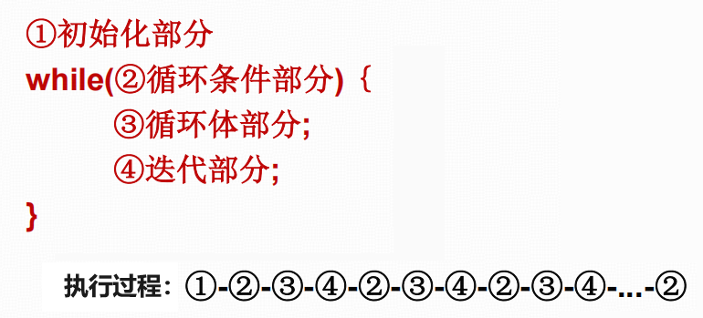

### 3.2.3 do-while

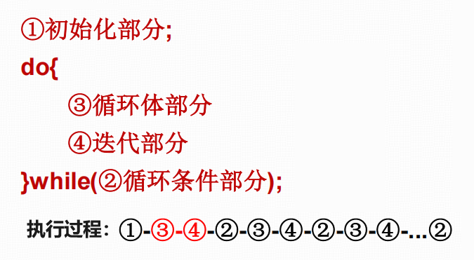

## 3.3 `break`和`continue`

| 关键字     | 使用范围               | 循环中使用的作用               | 相同点              |
|:---------:|:----------------------:|:-----------------------------:|:------------------:|
| `break`   | switch-case<br>循环结构 | 跳出当前循环                   | 后面不能声明执行语句 |
| `continue`| 循环结构                | 结束当次循环，立即开始下一次循环 | 后面不能声明执行语句 |

# 4 数组


